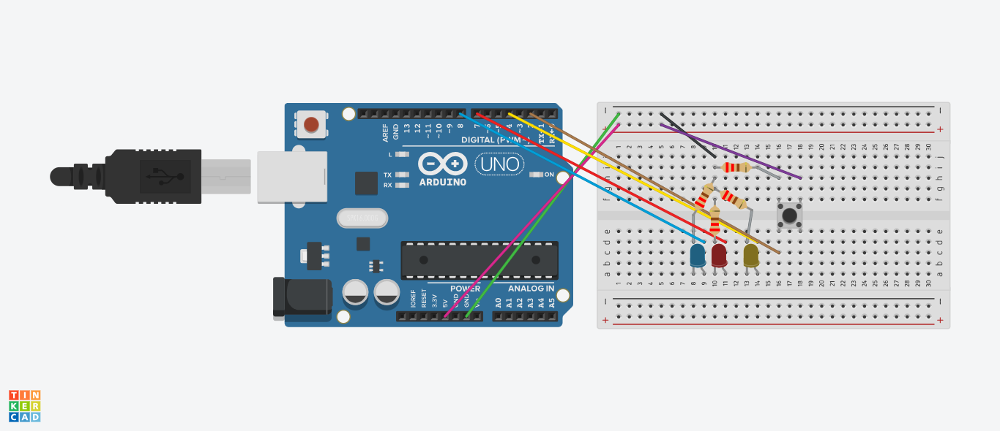

# 1. Button debounce + press classification

* Input: key button
* Output: LED / serial
* Detect short, long, double press

## Schematics

## Demo

### Demo Context
- LED classification:
    - Yellow = Click
    - Red = Hold
    - Blue = Double-Click
- I lacked 1 more jumper so I just made all resistors to hit GND and only needed 1 jumper for each LED afterwards. Saved 2 jumpers, had only 10.

## Solution
- See the [code I made for this project](./solution.ino)
