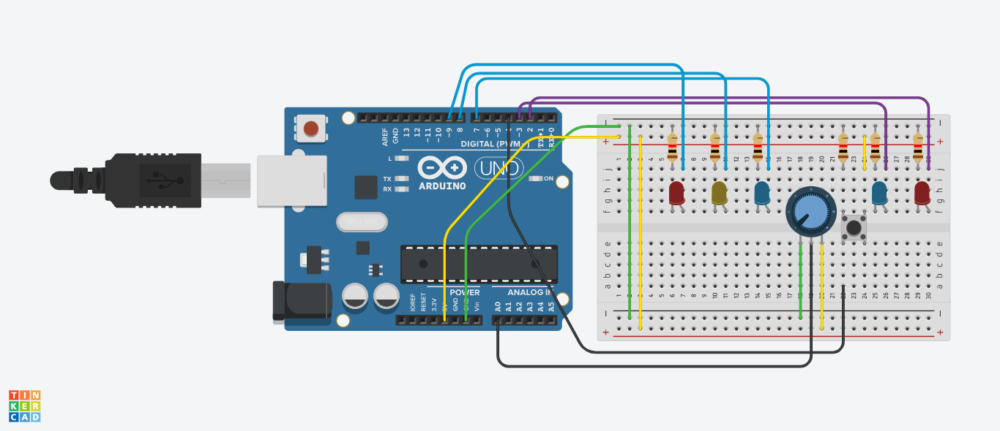
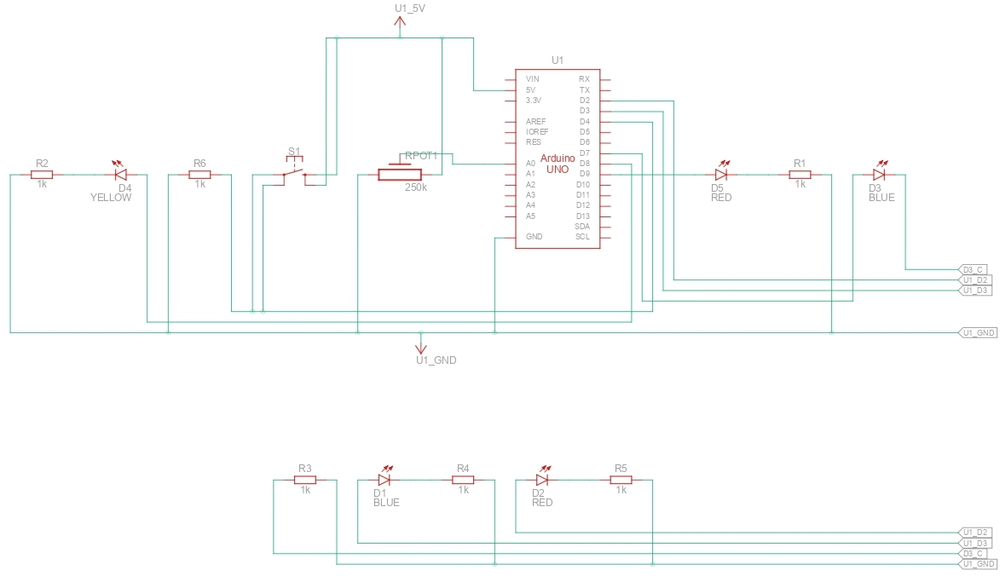

# 10. Software watchdog

* Detect frozen state logic
* Force system reset behavior

## Circuit

## Schematics

## Result

  

### Result Context
- **Blue LED Signal**: **Go Signal** lasts for 30 seconds.
- **Yellow LED Signal**: **Clearance Interval** lasts for 5 seconds.
- **Red LED Signal**: **Stop Signal** lasts for 60 seconds.
- ~~Interrupting the signal: Rotate the potentiometer to the desired signal shown in the pair of LEDs on the other side, then press the button to instantly go to Clearance Interval (yellow signal) then afterwards go to the desired signal~~
- **Fail-safe behavior (sensor disconnect simulation)**:
    When the potentiometer is disconnected, it consistently outputs near-maximum readings (~1023). The system detects this abnormal condition and automatically enters **safe mode**, overriding manual input. In this state:
    - The control input is ignored
    - The system defaults to a **safe traffic behavior** (controlled state)
    - Prevents unintended or unsafe signal switching due to invalid sensor data
- **Hardware watchdog recovery (system freeze protection)**:
    The system uses the built-in watchdog timer of the microcontroller to detect **critical execution failure**. If the main loop becomes unresponsive (e.g., due to a forced infinite loop or stalled logic), the watchdog is no longer reset within the configured timeout (~2 seconds), triggering an automatic system reboot. In this state:
    - The entire system is **reset to a known safe state**
    - All variables and logic are reinitialized
    - A serial message (`"Watchdog reset occurred"`) indicates that a watchdog-triggered reset happened

## Solution
- See the [code I made for this project](./solution.ino)
- **Note**: Started from the code of [micro-project 9](../9-fail-safe-logic-simulation/README.md), which started from [code of micro-project 8](../8-traffic-light-controller/README.md). Code hasn't yet been tested.
