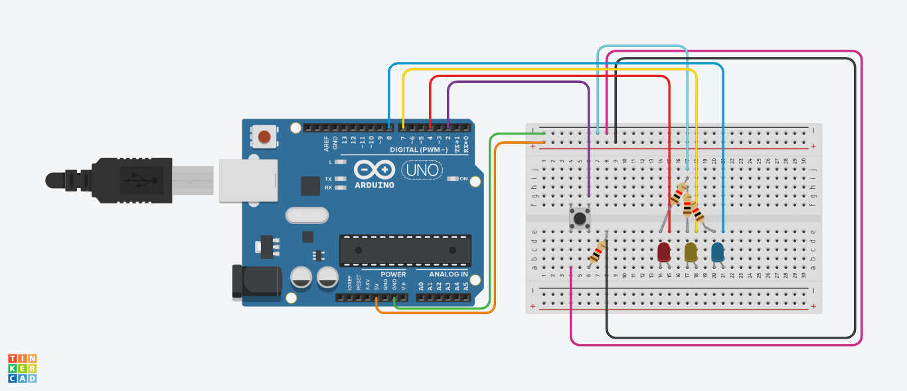
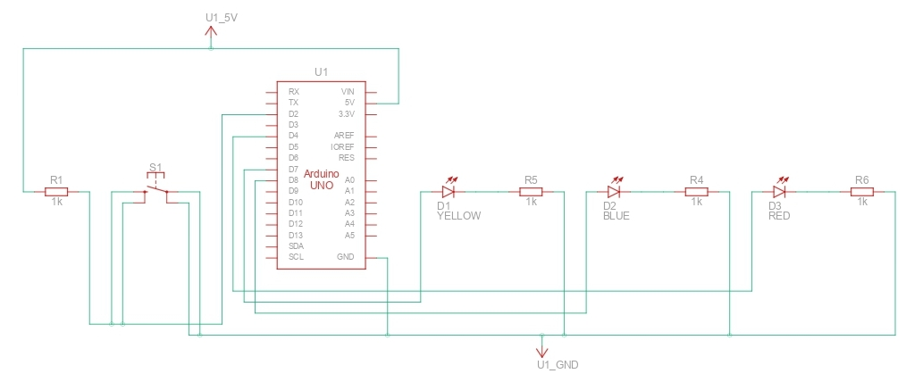

# 2. Multi-LED state machine

* LEDs cycle through modes
* Controlled by button

## Circuit

## Schematics

## Demo

### Demo Context
- Press classification:
    - Click = Change state by 1
    - Double-Click = Change state to last state
    - Hold = Change state to 0

## Solution
- See the [code I made for this project](./solution.ino)
