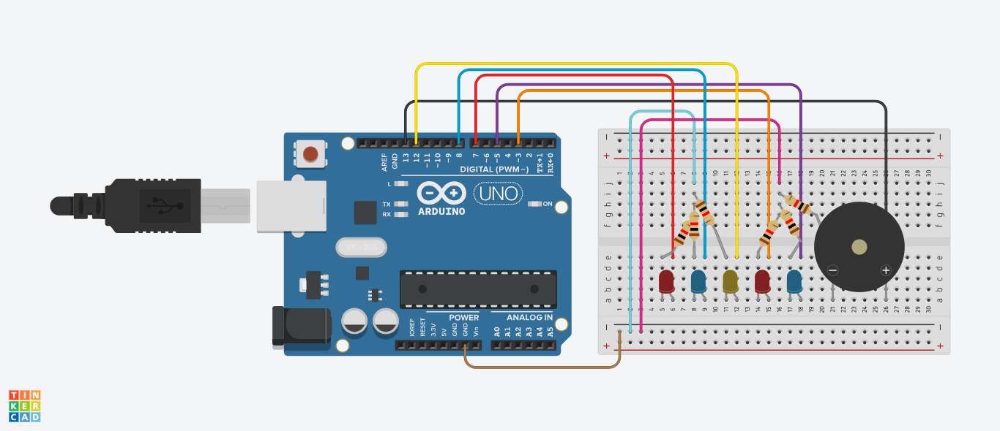
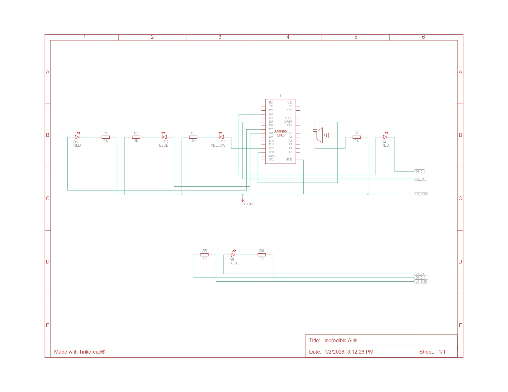
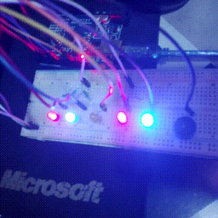

# 3. Software task scheduler

* Run LED blink, LED brightness change, and buzzer tick at different intervals
* No `delay()`*

## Circuit

## Schematics

## Demo

### Demo Context
- Sped up 2x to show that PWM Led 1 actually changes brightness without the demo file taking too much storage
- First 3 LEDs:
    - LED 1 (Red): Toggles every 1s
    - LED 2 (Blue): Toggles every 2s
    - LED 3 (Yellow): Toggles every 3s
- Last 2 LEDs (PWM):
    - LED 1 (Red): Increases/decreases brightness by 1 every 50ms
    - LED 2 (Blue): Increases/decreases brightness by 10 every 100ms
- Buzzer:
    - Toggles sound every 3s

## Solution
- See the [code I made for this project](./solution.ino)
