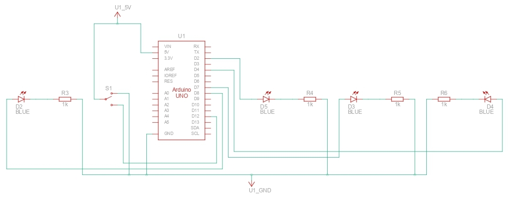
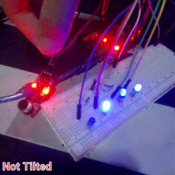

# 4. Priority override system

* Normal LED pattern
* Emergency input (ball switch) overrides everything

## Circuit

*(not 100% accurate since TinkerCad doesn't have the right ball switch or tilt switch)*

## Schematics

## Demo

  

### Demo Context
- When Ball Switch is titled, it activates the emergency state where the pattern goes much faster.
- When Ball Switch is not tilted, it defaults to normal pattern speed.

## Solution
- See the [code I made for this project](./solution.ino)
