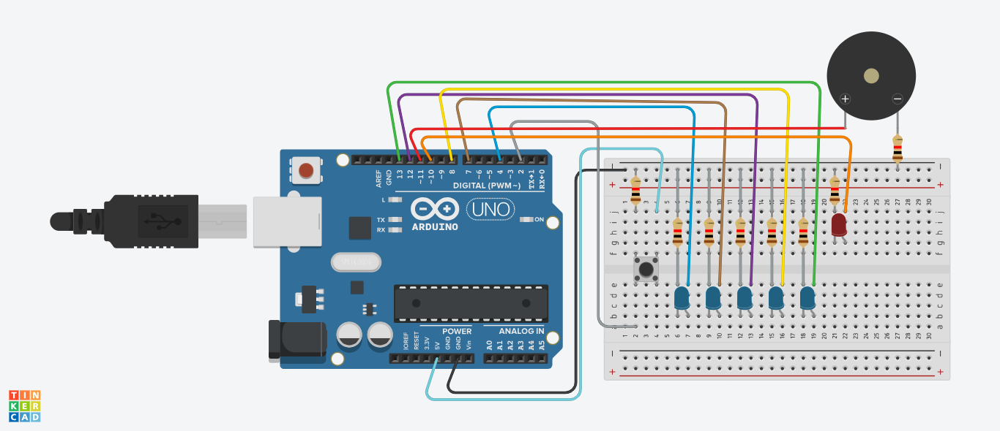
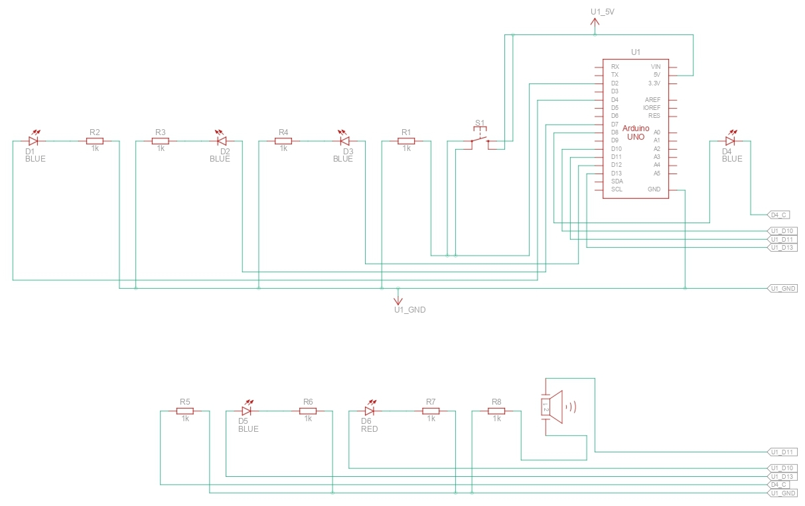
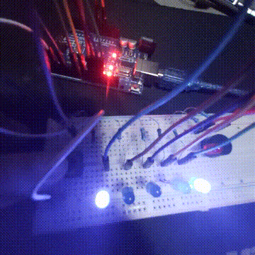

### 5. Non-blocking buzzer alert patterns

* Info / warning / error tones
* Triggered by button

## Circuit

*(not 100% accurate since TinkerCad doesn't have the right ball switch or tilt switch)*

## Schematics

## Demo

  

### Demo Context
- **Click (& Buzzer) Behavior:**
    - **Click (Info)**: Buzz at 2.2kHz (and light up led buzzer) for 200ms.
    - **Double-Click (Warning)**: Buzz at 2.3kHz (and light up led buzzer) for 1 second.
    - **Hold (Error)**: Buzz at 900Hz (and light up led buzzer) until the button is lifted.

## Solution
- See the [code I made for this project](./solution.ino)
