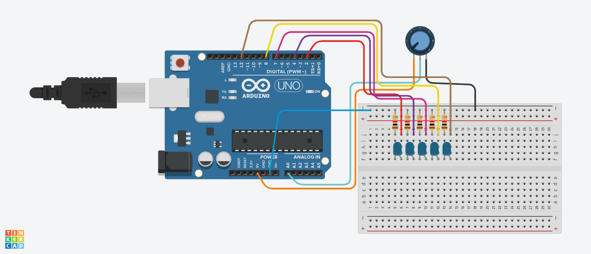
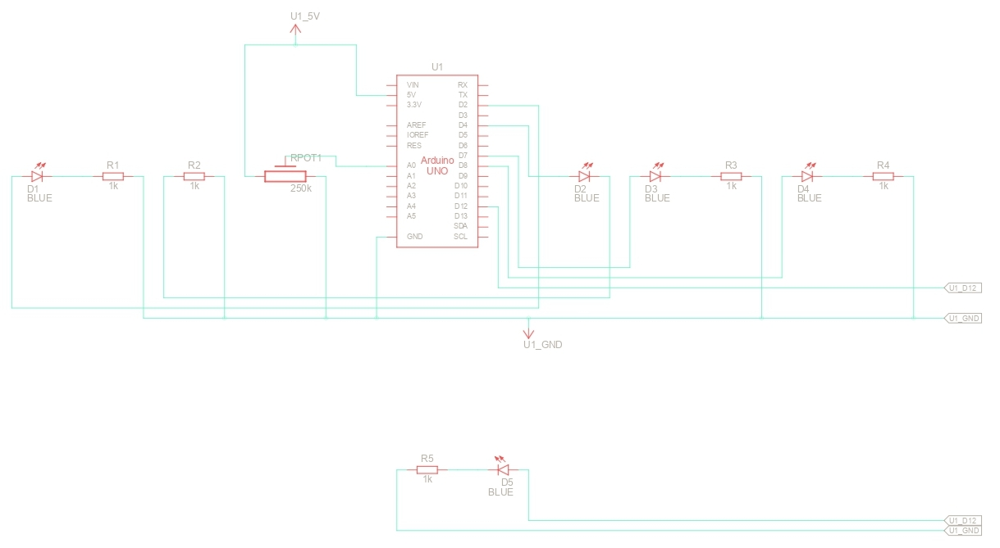
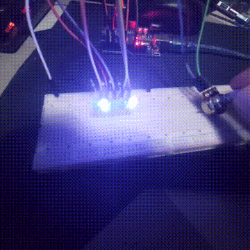

# 6. Analog threshold + hysteresis

* Input: potentiometer or photoresistor
* Output: LED/buzzer
* No flickering near threshold

## Circuit

## Schematics

## Demo

  

### Demo Context
- **Avoids flickering** of lights by:
    - **Turns on when value is at 500**, shows a normal pattern of lights.
    - **Turns off only when value is at 450**, lights completely turn off.
    - Meaning, value is free to jitter as much as it wants between 450 to 500 without affecting the lights' pattern

## Solution
- See the [code I made for this project](./solution.ino)
