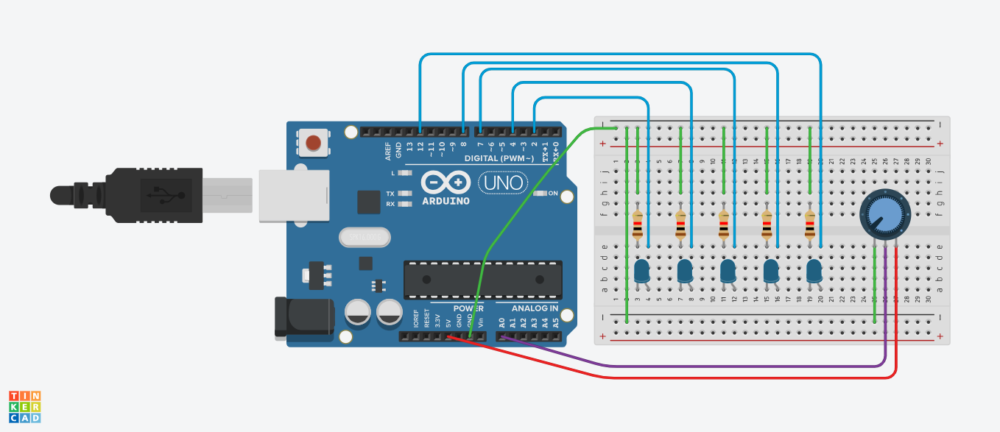
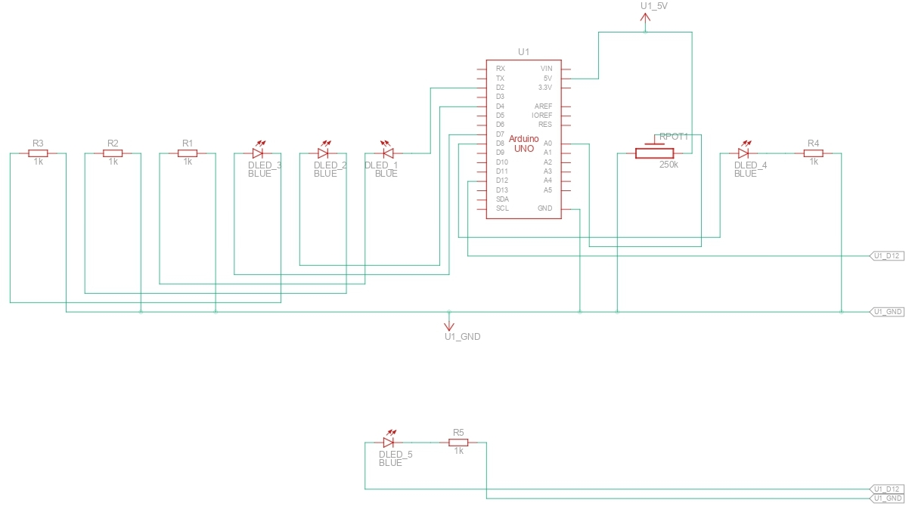
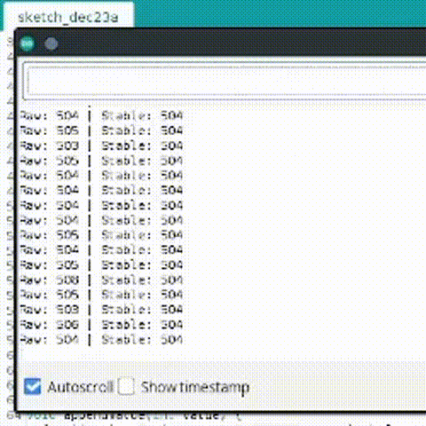

# 7. Input smoothing & noise filtering

* Apply rolling average to analog sensor
* Show raw vs filtered in serial

## Circuit

## Schematics

## Demo

  

### Demo Context
- **Stable:** Gets the 50 most recent values and takes their average 
- **Raw:** Actual current value of the potentiometer

## Solution
- See the [code I made for this project](./solution.ino)
