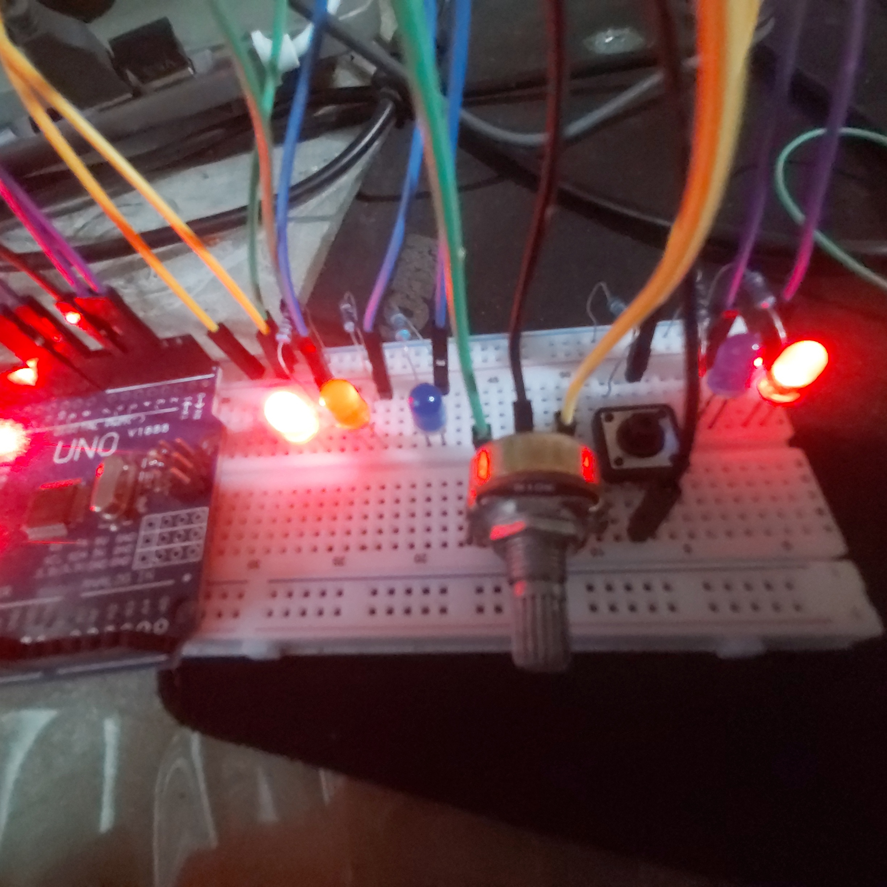

# 8. Traffic-light controller

* Red / Yellow / Green logic
* Time-based transitions

## Circuit

## Schematics

## Result

  

### Result Context
- **Blue LED Signal**: **Go Signal** lasts for 30 seconds.
- **Yellow LED Signal**: **Clearance Interval** lasts for 5 seconds.
- **Red LED Signal**: **Stop Signal** lasts for 60 seconds.
- **Interrupting the signal**: Rotate the potentiometer to the *desired signal* shown in the *pair of LEDs on the other side*, then press the button to instantly go to **Clearance Interval** *(yellow signal)* then afterwards go to the *desired signal*

## Solution
- See the [code I made for this project](./solution.ino)
